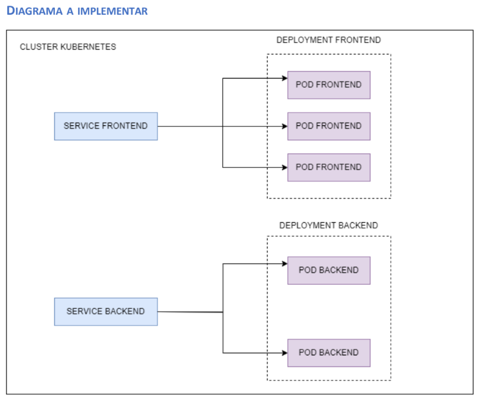

# Reto 2: Aplicación backend de alta disponibilidad

## Objetivo

Crear dos aplicaciones backend contenerizadas por Docker y orquestadas por Kubernetes

## Pasos

### 1. Aplicación Frontend (Pods Frontend)

Crear una aplicación backend con Java Sprint Boot que sirva una aplicación muy simple de frontend (Pods Frontend), es decir es una aplicación backend de Java que tendrá una ruta que servirá una web estática (html, js, css).

**Ejemplo:** `app.use(express.static(...))`

### 2. Aplicación Backend (Pods Backend)

Crear una aplicación backend con Java (Pods Backend) que implementará un Api Rest con un único endpoint que traiga una lista de productos (hard-coded) con la siguiente estructura:

```json
[
  {
    "productId": 1,
    "title": "Title 01"
  },
  {
    "productId": 2,
    "title": "Title 02"
  }
]
```

### 3. Dockerfiles

Crear los dockerfiles para contenerizar las aplicaciones de los pasos 1 y 2.

### 4. Orquestar con Kubernetes

Se esperan los siguientes manifiestos:

- **a.** Deployment y Service de la aplicación del paso 1
- **b.** Deployment y Service de la aplicación del paso 2

## Diagrama a Implementar



La arquitectura consta de:

- **Deployment Frontend**: Con 3 réplicas de pods expuestos mediante un Service de tipo NodePort
- **Deployment Backend**: Con 2 réplicas de pods expuestos mediante un Service de tipo ClusterIP

El Service Frontend permite acceso externo al cluster, mientras que el Service Backend solo es accesible internamente dentro del cluster de Kubernetes.

## Observaciones

- El deployment del paso 1 debe considerar una réplica de 3 y el del paso 2 debe considerar una réplica de 2
- El service del paso 1 debe ser de tipo **NodePort**. El service del paso 2 debe ser de tipo **ClusterIP**.
- Asuma los puertos de los services.
- La web estática puede ser un archivo index.html, una hoja de estilos simple y un script de javascript que muestre un mensaje en el html. En este reto no se evalúa conocimientos de frontend.

## Entregables

El código desarrollado en un repositorio de Git (Github, Gitlab, Bitbucket, etc.) con acceso público. Enviar la url.

Por código se debe entender lo siguiente:

- Código de ambas aplicaciones backend
- Los dockerfiles de ambas aplicaciones
- Los manifiestos para orquestar en Kubernetes
